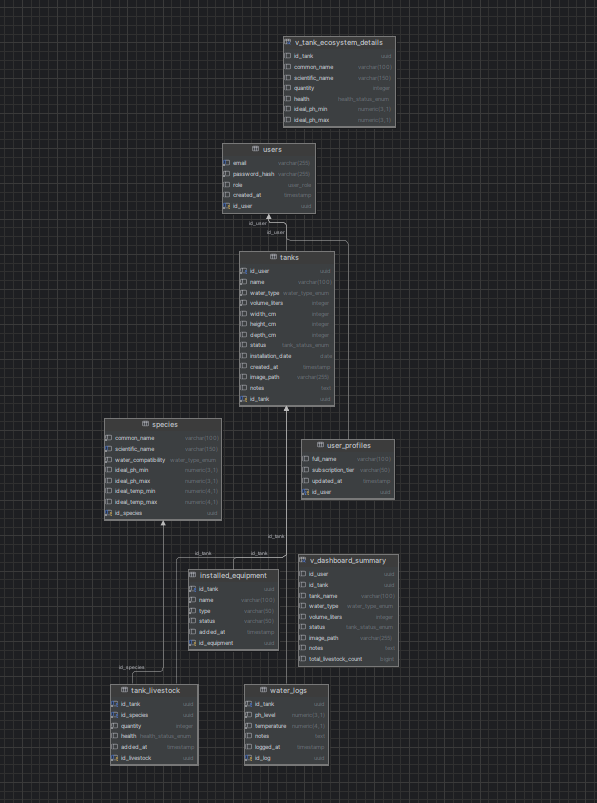
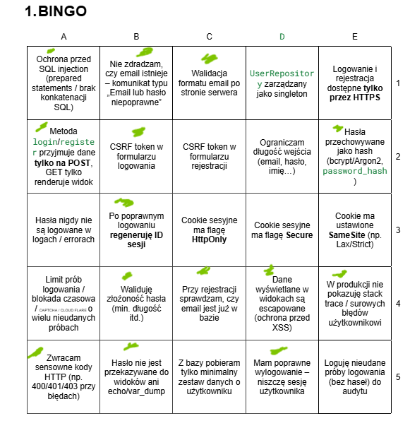
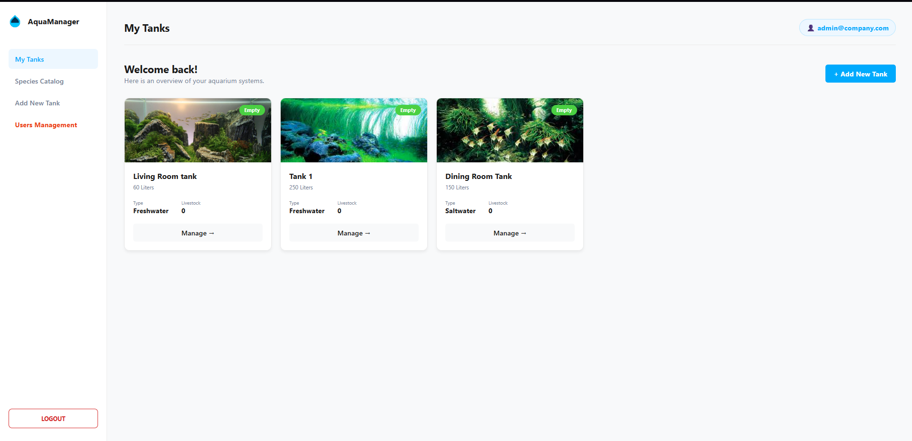
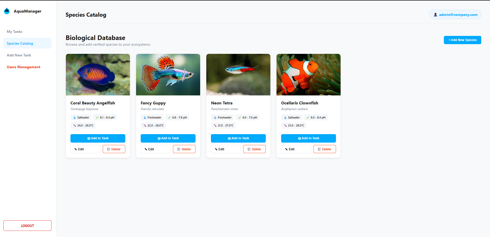
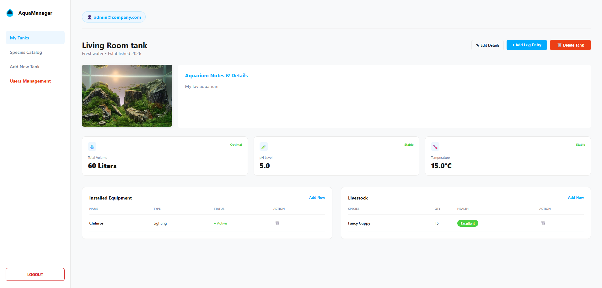
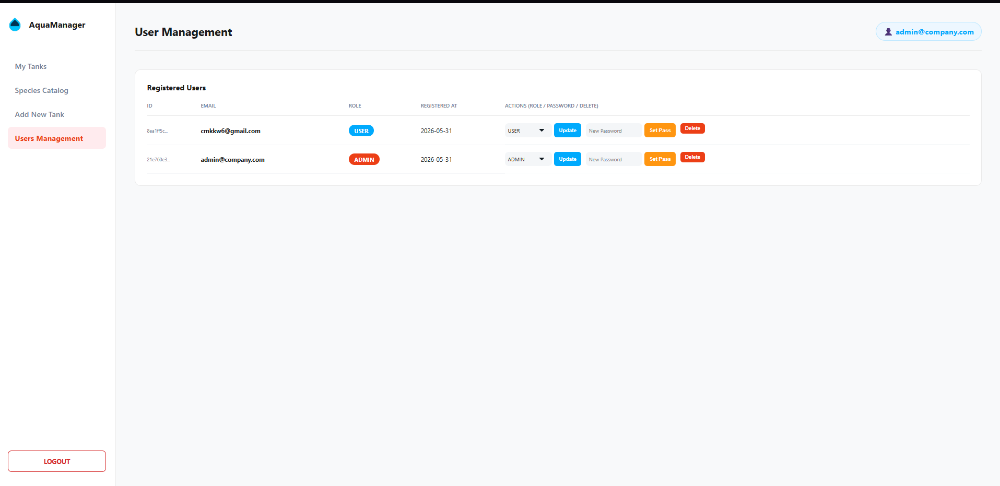
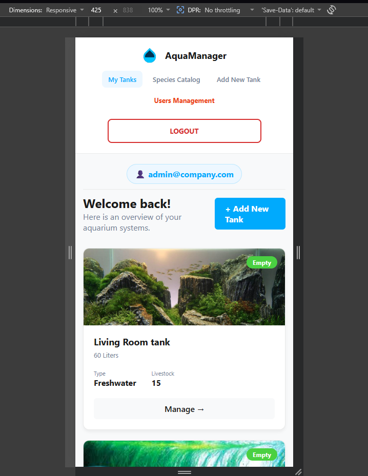
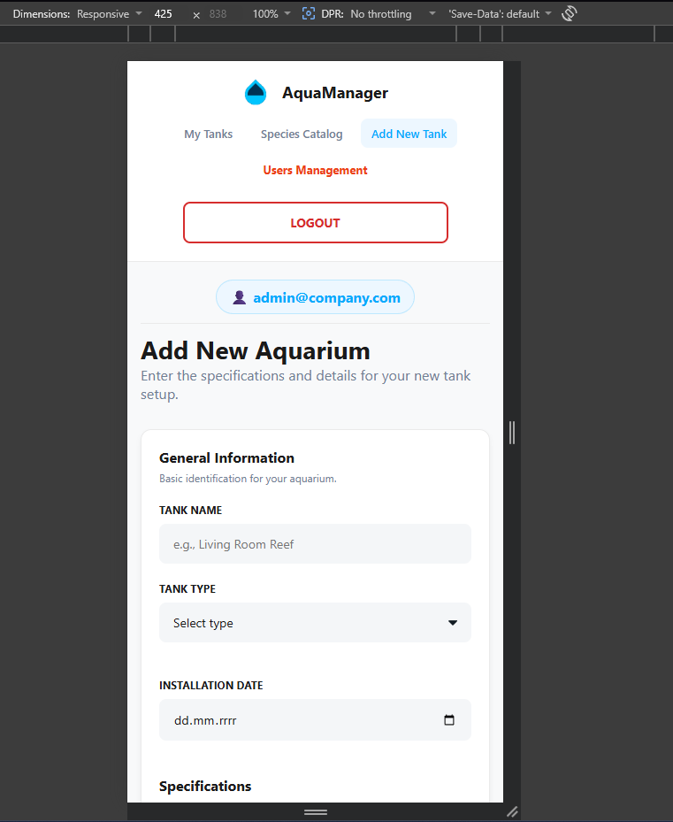
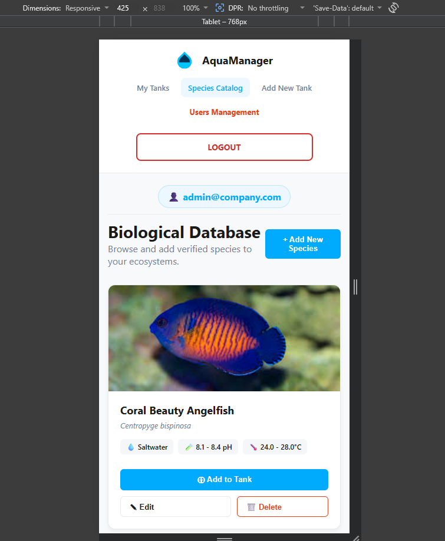
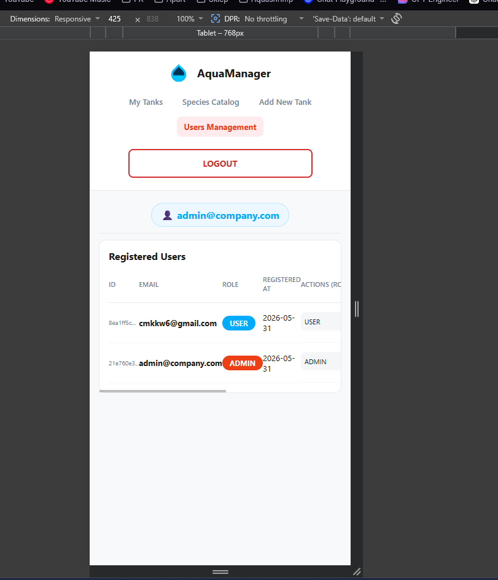

# AquaManager - System Zarządzania Akwarystyką

Aplikacja internetowa zrealizowana w ramach zaliczenia laboratorium z projektowania aplikacji internetowych. System umożliwia zarządzanie ekosystemami akwarystycznymi, wprowadzanie dzienników parametrów wody, instalację wirtualnego osprzętu oraz katalogowanie obsady biologicznej, opierając się na natywnym kodzie PHP bez wykorzystania gotowych frameworków.

---

## 1. Technologie i Architektura

Aplikacja została zbudowana zgodnie z paradygmatem programowania obiektowego **OOP** oraz architekturą **MVC (Model-View-Controller)**.

### Wykorzystane technologie

- **Backend:** PHP 8.3  
  Obiektowy kod PHP, własny autoloader, autorski router HTTP.

- **Baza danych:** PostgreSQL  
  Relacyjna baza danych, zachowana 3 Postać Normalna.

- **Frontend:** HTML5, CSS3, Vanilla JavaScript  
  Responsywność oparta o Media Queries, Flexbox i Grid. Fetch API wykorzystywane do asynchronicznych operacji w katalogu.

- **Infrastruktura:** Docker & Docker Compose  
  Środowisko złożone z kontenerów Nginx, PHP-FPM, PostgreSQL oraz pgAdmin.

### Diagram Warstwowy Architektury

```text
[ Klient / Przeglądarka ] <---(HTTP/HTTPS)---> [ Serwer Nginx ]
                                                     |
[ Baza PostgreSQL ] <---(PDO / SQL)---> [ Aplikacja PHP (Backend) ]
                                                     |
   +-------------------------------------------------+
   |  Routing -> Przechwytuje request i kieruje do kontrolera
   |  Controllers -> Walidacja uprawnień (Security), logika biznesowa
   |  Repository -> Zapytania SQL, obsługa transakcji, mapowanie na obiekty
   |  Models -> Reprezentacja struktur danych (User, Tank, Log, Species)
   |  Views -> Generowanie interfejsu (wyłącznie HTML + dane z backendu)
   +-------------------------------------------------+
```
## 2. Baza Danych PostgreSQL

Struktura bazy danych została udokumentowana na diagramie ERD, znajdującym się w pliku `erd-diagram.png` w repozytorium. Baza posiada zaawansowane mechanizmy wymuszające spójność danych.
### Diagram Relacyjny Bazy Danych (ERD)


### Relacje

Zaimplementowano następujące typy relacji:

- **1:1**  
  `users -> user_profiles`

- **1:N**  
  `tanks -> water_logs`  
  `tanks -> installed_equipment`

- **N:M**  
  `tanks <-> species`  
  Relacja zrealizowana przez tabelę łączącą `tank_livestock`.

### Widoki VIEWS

W bazie danych utworzono dwie wirtualne tabele:

- `v_dashboard_summary`  
  Agregacja danych o akwarium z użyciem `LEFT JOIN`.

- `v_tank_ecosystem_details`  
  Szczegółowy widok ekosystemu akwarium.

### Wyzwalacze i funkcje TRIGGERS & FUNCTIONS

Zaprogramowano trigger:

```sql
trg_check_livestock_compatibility
```
oraz funkcję:
```sql
fn_validate_water_compatibility()
```
Funkcja rzuca wyjątkiem na poziomie silnika bazy danych, blokując próbę dodania gatunku słodkowodnego do morskiego akwarium lub odwrotnie.

### Transakcje

Dodawanie akwarium wymusza pełną izolację transakcji:
```sql
BEGIN;
COMMIT;
ROLLBACK;
```
Transakcje wykonywane są na poziomie izolacji:
```sql
READ COMMITTED
```
### Bezpieczeństwo integralności danych

W bazie danych zastosowano:

- brak redundancji danych,
- kaskadowe usuwanie danych za pomocą ON DELETE CASCADE,
- klucze główne typu UUID,
- relacje zgodne z 3 Postacią Normalną.

## 3. Bezpieczeństwo

System został uszczelniony przed standardowymi wektorami ataków webowych i spełnia założenia **Security Bingo**.
### Weryfikacja Security Bingo


### Ochrona przed SQL Injection

Zaimplementowano pełną obsługę **Prepared Statements**:

```php
PDO::prepare()
```
oraz bindowanie zmiennych do zapytań SQL.

### Szyfrowanie i hasła

Hasła użytkowników są hashowane za pomocą funkcji:

```php 
password_hash()
```
z wykorzystaniem algorytmu:
```php 
BCRYPT
```
Dodatkowo:
- minimalna długość hasła walidowana jest po stronie serwera,
- hasło musi mieć co najmniej 8 znaków,
- logowanie nie ujawnia, czy dany adres e-mail istnieje w systemie,
- komunikaty błędów logowania są generyczne.
### Ochrona sesji

Po poprawnym zalogowaniu następuje regeneracja identyfikatora sesji:
```php 
session_regenerate_id(true)
```
Chroni to aplikację przed atakiem Session Fixation.

### Ochrona przed XSS

Dane pobierane z bazy przed wyrenderowaniem są zabezpieczane funkcją:
```php 
htmlspecialchars()
```
### Ochrona przed CSRF

Formularz logowania zawiera kryptograficzny token CSRF, który jest sprawdzany podczas obsługi żądań metodą POST.

## 4. Instrukcja Uruchomienia i Zmienne Środowiskowe

Aplikacja jest w pełni skonteneryzowana.

### Plik `.env.example`

Nie ma wymogu tworzenia osobnego pliku `.env`, ponieważ zmienne logowania do bazy danych oraz pgAdmina zostały zainicjowane bezpośrednio w konfiguracji `docker-compose.yml` oraz w plikach inicjalizacyjnych `.sql`.

Dotyczy to między innymi:

- użytkownika bazy danych,
- hasła bazy danych,
- nazwy bazy danych,
- danych logowania do pgAdmina.

### Uruchomienie aplikacji Docker

Inicjalizacja kontenerów, budowanie obrazów i uruchomienie środowiska w tle:

```bash
docker compose up -d --build
```

Aplikacja będzie dostępna w przeglądarce pod adresem:

```text
http://localhost:8080
```

Panel zarządzania bazą danych pgAdmin będzie dostępny pod adresem:

```text
http://localhost:5050
```

Dane logowania do pgAdmina:

```text
E-mail: admin@example.com
Hasło: admin
```

### Uruchomienie testów automatycznych PHPUnit

```bash
docker compose exec -w /app php php phpunit.phar tests/TankTest.php
```

### Uruchomienie testu integracyjnego Bash

```bash
bash test_endpoint.sh
```

Alternatywnie:

```bash
curl.exe -I http://localhost:8080/login
```
## 5. Scenariusze Testowe

### Test ról i autoryzacji HTTP 403

1. Zaloguj się na konto administratora:

```text
E-mail: admin@company.com
Hasło: admin
```

2. Po zalogowaniu jako administrator dostępna jest zakładka:

```text
Users Management
```

3. Utwórz nowe konto użytkownika z rolą `User` przez formularz:

```text
/register
```

4. Spróbuj ręcznie wejść na adres:

```text
/users
```

5. Zwykły użytkownik otrzyma błąd:

```text
HTTP 403 Forbidden
```

Błąd obsługiwany jest przez dedykowany `ErrorController`.

### Test globalnej obsługi błędów HTTP 404

1. Wpisz w pasku adresu nieistniejącą ścieżkę, na przykład:

```text
/brak-strony
```

2. Aplikacja wyrenderuje estetyczny ekran błędu:

```text
HTTP 404 Not Found
```

Stack trace błędu pozostaje ukryty przed użytkownikiem.

### Test logiki biznesowej wyzwalacz bazy danych

1. Dodaj do systemu akwarium typu:

```text
Akwarium Słodkowodne
```

2. Przejdź do szczegółów akwarium.

3. Wybierz opcję:

```text
Add Livestock
```

4. Spróbuj dodać gatunek słonowodny, na przykład:

```text
Ocellaris Clownfish
```

5. Operacja zostanie zablokowana przez trigger PostgreSQL, a aplikacja rzuci odpowiedni błąd biznesowy.

### Test CRUD i kaskadowości usuwania

Dla modelu `Tank` można przetestować pełny zestaw operacji CRUD:

- tworzenie akwarium,
- edycję akwarium,
- wyświetlanie szczegółów akwarium,
- usuwanie akwarium.

Usunięcie akwarium automatycznie usuwa powiązane z nim:

- logi parametrów wody,
- sprzęt,
- obsadę biologiczną.

Jest to realizowane dzięki relacjom:

```sql
ON DELETE CASCADE
```
## 6. Zrzuty Ekranu Interfejsu
### Wersja Webowa Desktop


**Panel Główny (Dashboard)**


**Katalog Gatunków (Fetch API)**


**Szczegóły Akwarium (Relacje i Widoki bazy)**


**Panel Administratora (Kontrola ról)**



### Wersja Mobilna Media Queries

**Panel Główny (Dashboard)**


**Formularz Dodawania Akwarium**


**Katalog Gatunków**


**Panel Administratora**


## 7. Checklista Zrealizowanych Założeń
- [x] Projekt indywidualny oparty na technologiach Docker, GIT, HTML5, CSS, JS Fetch API i obiektowym PHP bez użycia gotowych frameworków.
- [x] Zastosowanie architektury MVC rozdzielającej warstwy logiczne i widoki.
- [x] Zrealizowane filary programowania obiektowego, zasady SOLID oraz bezwzględny brak programowania strukturalnego.
- [x] Aplikacja estetyczna i w 100% responsywna (udokumentowane CSS Media Queries).
- [x] Działające logowanie, utrzymanie sesji, wylogowanie i panel rejestracji oparty o walidację danych Security Bingo.
- [x] Autoryzacja i zróżnicowanie uprawnień użytkowników (Admin / User) z dedykowanym panelem zarządzania.
- [x] Zaawansowana relacyjna baza danych PostgreSQL (relacje 1:1, 1:N, N:M) wyeksportowana do kompletnego pliku SQL wraz z danymi.
- [x] Spełniona 3 Postać Normalna, eliminacja anomalii, redundancji oraz dopasowane typy danych.
- [x] Zaimplementowane 2 widoki złączeniowe, funkcja, wyzwalacz i jawna transakcja na odpowiednim poziomie izolacji.
- [x] Globalna i estetyczna obsługa błędów HTTP 400, 403, 404, 500.
- [x] Testy jednostkowe obiektu domeny (PHPUnit) oraz bashowy skrypt integracyjny weryfikujący stabilność endpointów.
- [x] Systematyczne wersjonowanie projektu na publicznym repozytorium (powyżej 40 commitów).
- [x] Kompletna dokumentacja techniczna: diagram ERD z linkiem do źródła (.drawio), screeny (Web/Mobile), architektura w
